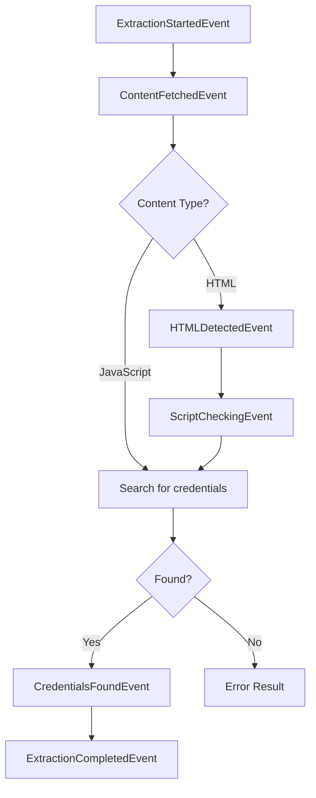

Types related to the `extractFromUrl()` function and its event system.

## ExtractedCredentials

The result type returned when Supabase credentials are successfully extracted.

```typescript extractor.types.ts
export type ExtractedCredentials = {
  url: string;
  key: string;
  source?: string;
};
```

### Fields

<ResponseField name="url" type="string" required>
  The Supabase project URL (e.g., `https://xxx.supabase.co`)
</ResponseField>

<ResponseField name="key" type="string" required>
  The Supabase API key (JWT token starting with `eyJhbGciOiJIUzI1NiIsInR5cCI6IkpXVCJ9`)
</ResponseField>

<ResponseField name="source" type="string">
  The source where credentials were found (e.g., `"inline script"`, `"https://example.com/app.js"`)
</ResponseField>

### Example

```typescript
const credentials: ExtractedCredentials = {
  url: 'https://abc123.supabase.co',
  key: 'eyJhbGciOiJIUzI1NiIsInR5cCI6IkpXVCJ9.eyJpc3MiOiJzdXBhYmFzZSIsInJvbGUiOiJhbm9uIn0.xxx',
  source: 'https://example.com/bundle.js'
};
```

---

## ExtractorEvent

Union type of all events emitted during credential extraction.

```typescript extractor.types.ts
export type ExtractorEvent =
  | ExtractionStartedEvent
  | ContentFetchedEvent
  | HTMLDetectedEvent
  | ScriptCheckingEvent
  | CredentialsFoundEvent
  | ExtractionCompletedEvent;
```

---

## ExtractionStartedEvent

Emitted when the extraction process begins.

```typescript extractor.types.ts
export interface ExtractionStartedEvent
  extends Event<"extraction_started", { url: string }> {
  type: "extraction_started";
  data: { url: string };
}
```

### Data Fields

<ResponseField name="url" type="string" required>
  The URL being analyzed
</ResponseField>

### Example

```typescript
const event: ExtractionStartedEvent = {
  type: 'extraction_started',
  data: { url: 'https://example.com' }
};
```

---

## ContentFetchedEvent

Emitted after successfully fetching the URL content.

```typescript extractor.types.ts
export interface ContentFetchedEvent
  extends Event<
    "content_fetched",
    { url: string; size: number; contentType: string }
  > {
  type: "content_fetched";
  data: { url: string; size: number; contentType: string };
}
```

### Data Fields

<ResponseField name="url" type="string" required>
  The URL that was fetched
</ResponseField>

<ResponseField name="size" type="number" required>
  Size of the fetched content in bytes
</ResponseField>

<ResponseField name="contentType" type="string" required>
  MIME type from the Content-Type header
</ResponseField>

### Example

```typescript
const event: ContentFetchedEvent = {
  type: 'content_fetched',
  data: {
    url: 'https://example.com',
    size: 125000,
    contentType: 'text/html; charset=utf-8'
  }
};
```

---

## HTMLDetectedEvent

Emitted when HTML content is detected and parsed.

```typescript extractor.types.ts
export interface HTMLDetectedEvent
  extends Event<"html_detected", { scriptCount: number }> {
  type: "html_detected";
  data: { scriptCount: number };
}
```

### Data Fields

<ResponseField name="scriptCount" type="number" required>
  Total number of script tags found (inline + external)
</ResponseField>

### Example

```typescript
const event: HTMLDetectedEvent = {
  type: 'html_detected',
  data: { scriptCount: 12 }
};
```

---

## ScriptCheckingEvent

Emitted when checking an external JavaScript file.

```typescript extractor.types.ts
export interface ScriptCheckingEvent
  extends Event<"script_checking", { scriptUrl: string }> {
  type: "script_checking";
  data: { scriptUrl: string };
}
```

### Data Fields

<ResponseField name="scriptUrl" type="string" required>
  The URL of the external script being analyzed
</ResponseField>

### Example

```typescript
const event: ScriptCheckingEvent = {
  type: 'script_checking',
  data: { scriptUrl: 'https://example.com/static/js/main.abc123.js' }
};
```

---

## CredentialsFoundEvent

Emitted when Supabase credentials are discovered.

```typescript extractor.types.ts
export interface CredentialsFoundEvent
  extends Event<"credentials_found", { source: string }> {
  type: "credentials_found";
  data: { source: string };
}
```

### Data Fields

<ResponseField name="source" type="string" required>
  Where the credentials were found (e.g., `"inline script"`, script URL)
</ResponseField>

### Example

```typescript
const event: CredentialsFoundEvent = {
  type: 'credentials_found',
  data: { source: 'inline script' }
};
```

---

## ExtractionCompletedEvent

Emitted when extraction successfully completes.

```typescript extractor.types.ts
export interface ExtractionCompletedEvent
  extends Event<"extraction_completed", { credentials: ExtractedCredentials }> {
  type: "extraction_completed";
  data: { credentials: ExtractedCredentials };
}
```

### Data Fields

<ResponseField name="credentials" type="ExtractedCredentials" required>
  The extracted Supabase credentials. See [ExtractedCredentials](#extractedcredentials).
</ResponseField>

### Example

```typescript
const event: ExtractionCompletedEvent = {
  type: 'extraction_completed',
  data: {
    credentials: {
      url: 'https://abc123.supabase.co',
      key: 'eyJhbGciOiJIUzI1NiIsInR5cCI6IkpXVCJ9...',
      source: 'https://example.com/app.js'
    }
  }
};
```

---

## Event Flow

Typical event sequence during extraction:



## Usage Example

```typescript
import { extractFromUrl, type ExtractorEvent } from '@supascan/core';

const generator = extractFromUrl('https://example.com');

for await (const event of generator) {
  switch (event.type) {
    case 'extraction_started':
      console.log(`Starting extraction from ${event.data.url}`);
      break;
      
    case 'content_fetched':
      console.log(`Fetched ${event.data.size} bytes (${event.data.contentType})`);
      break;
      
    case 'html_detected':
      console.log(`Analyzing ${event.data.scriptCount} scripts`);
      break;
      
    case 'script_checking':
      console.log(`Checking: ${event.data.scriptUrl}`);
      break;
      
    case 'credentials_found':
      console.log(`Found credentials in: ${event.data.source}`);
      break;
      
    case 'extraction_completed':
      console.log('Extraction complete!');
      console.log('URL:', event.data.credentials.url);
      console.log('Key:', event.data.credentials.key);
      break;
  }
}
```

## Related

- [extractFromUrl() Function](/api/extractor)
- [AnalysisResult Types](/api/types/analysis-result)
- [Result Type](/api/types/result)
